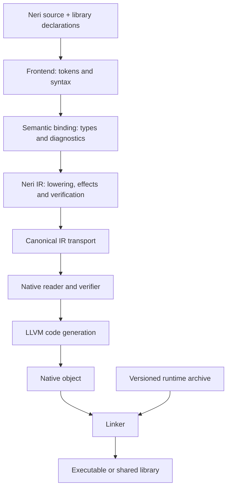

# Architecture

This page maps implementation ownership and cross-layer invariants. For source
syntax and examples, use the [language reference](LANGUAGE.md); for native calls,
use [C interoperability](C-INTEROP.md). Source-checkout guides cover
[build commands](../docs/BUILDING.md) and
[seed prerequisites](../docs/BOOTSTRAP.md).

| Question | Start here | Source of truth in a source checkout |
| --- | --- | --- |
| Where is source syntax or typing implemented? | [Compiler](#compiler) | [Parser](../compiler/frontend/bootstrap_parser.hk), [binder](../compiler/semantic/binder.hk) |
| How do call effects and parallel callbacks propagate? | [Effect summaries](#effect-summaries) | [Effect solver](../compiler/ir/effects.hk), [parallel checking](../compiler/ir/parallel.hk) |
| Who owns library signatures and intrinsic contracts? | [Source and intrinsic boundary](#source-and-intrinsic-boundary) | [Library catalog](../compiler/frontend/standard_library_catalog.hk), [ABI catalog](../tooling/abi/catalog.hk) |
| What does the native backend accept? | [Native boundary](#native-boundary) | [IR reader](../native/codegen/ir_reader.cpp), [verifier](../native/codegen/ir_verifier.cpp) |
| How are compiler generations built and compared? | [Build driver](#build-driver) | [Build driver](../tooling/build.hk), [seed generation](../tooling/seed.hk) |
| What may a parallel task read, mutate or return? | [Execution and optimization boundaries](#execution-and-optimization-boundaries) | [Task heap](../native/runtime/task_heap.h), [executor](../native/runtime/task_executor.cpp) |

The compiler, native backend/runtime, and build tooling have separate ownership.

## Compiler

`compiler/` is the production compiler and is written entirely in Neri:

- `frontend/` tokenizes and parses source files;
- `semantic/` binds symbols, types, control flow, and diagnostics;
- `ir/` lowers bound programs to canonical Neri IR and provides the command-line driver.

Generic declarations, specialization, and inference live in separate semantic
components. `GenericInference` owns the type-variable bindings for one application.
The binder registers templates before resolving signatures, then processes newly
specialized bodies until the work set is complete. Specialization clones syntax
at type positions and preserves source locations. Concrete classes retain the
existing field layout and precise tracing rules; concrete functions use the same
IR and runtime ABI as ordinary functions. Specializations are cached by qualified
declaration name and canonical type arguments, with bounded expansion.

Managed function types are structural language types. Closure conversion represents each
signature with a hidden managed class and virtual invocation slot, and each
closure with an implementation class containing its captures. Class
allocation, tracing and indirect dispatch provide closure lifetime and invocation
through the ordinary IR transport and runtime ABI. The signature class is not
source-constructible, and its fallback invocation traps. A callee's `noreturn`
property does not propagate to callers or other implementations of its slot.

`cabi fn` is a distinct structural type with native function-pointer storage.
It does not use a managed signature class or capture object. Named
`@cabiImport` and `@cabiExport` functions can supply matching native pointers;
indirect invocation requires an unsafe context. Signature encoding and call
binding live in [cabi_types.hk](../compiler/semantic/cabi_types.hk) and
[cabi_calls.hk](../compiler/semantic/cabi_calls.hk). See
[C interoperability](C-INTEROP.md) for exact type, lifetime and nullable-pointer
contracts.

[`compiler/ir/main.hk`](../compiler/ir/main.hk) is the executable entry point.
The root [manifest](../manifest.json) defines the `compiler` unit and its
`compiler-core` dependency. `frontend/main.hk` and `semantic/main.hk` belong to
separate development units. Session sources also belong to a separate unit:
changes to shared compiler APIs must be checked through session consumers as
well as the compiler executable.

`semantic/readonly.hk` defines transitive readonly views. Binding preserves the
qualifier on reachable references and checks receiver contracts, assignments,
calls, returns and borrowed storage. IR lowering erases view qualifiers without
copying objects or adding runtime wrappers. No LLVM aliasing or purity property
is inferred from a readonly view: mutable aliases may exist elsewhere.
The distinction between read-only access and globally immutable or exclusive
references follows the separation studied by
[Gordon et al. (2012)](https://www.microsoft.com/en-us/research/publication/uniqueness-and-reference-immutability-for-safe-parallelism/).
Neri implements readonly views, not that paper's full isolation type system.

### Effect summaries

`EffectSet` represents function effects; `RuntimeFeatures` represents required
runtime capabilities. Both expose immutable, named set operations, and their
distinct types prevent mixing the two domains. Numeric masks cross the IR
serialization and runtime-manifest boundaries through explicit methods.

`compiler/ir/effects.hk` computes transitive summaries over the lowered call graph,
including virtual-call targets. Each function starts with its local effects and
the safepoint effect of known calls. A callee contributes all its effects except
`noreturn`, which describes that function's control flow, not its callers.

The solver uses reverse call edges and a deduplicated work queue. A summary is a
set of eight effect bits; union only adds information. Each function's set can
grow at most eight times, so the queue terminates even for recursive cycles.
At termination every caller contains its callees' propagated effects. Starting
from local effects and adding only required bits yields the least fixed point.
This is a finite monotone dataflow analysis; the general foundation is
[Kildall's global analysis framework (1973)](https://doi.org/10.1145/512927.512945).

For `V` functions and `E` call edges, propagation takes `O(V + 8E)` work and
scratch storage takes `O(V + E)`. Building the reverse graph still uses linear
name lookup and can take `O(VE)` work. These bounds describe this pass, not the
whole compiler. Queue and reverse-edge state are private to analysis and are
absent from serialized IR. Read/write summaries do not distinguish local mutable
state from shared state and are not a proof that a closure is safe to run on
another thread.

`compiler/ir/parallel.hk` checks the `parallel fn` effect contract using the same
worklist solver. Its compiler-local graph preserves receiver types before IR
upcasts, including inherited implementations and applicable overrides. Calls
through weaker callback types and unapproved runtime services carry a forbidden
effect marker. Recursive and indirect calls propagate that marker to callback
implementations. This analysis runs only when parallel callback types occur.

Serialized IR retains the conservative union of every virtual-slot implementation
required by the native verifier. The callback analysis graph is discarded after
checking. Capture access remains a semantic type rule; mutable argument ownership
and task lifetime are separate contracts.

## Data abstraction and library types

Classes provide nominal identity, private representation, checked construction,
generic parameters and ordinary virtual methods. Operator and explicit conversion
annotations attach metadata to those methods. The semantic binder resolves them
to the same instance calls used by named methods; lowering, effect analysis,
debug information and code generation share the existing call infrastructure.
The mechanism is owned by the declaring class and has no global registry of
user type names.
Builtin operand types retain their existing operations without traversing the
class registry for every arithmetic expression.

Abstractness is semantic state on class and method symbols. Binding rejects
abstract construction and requires a concrete class to close each nearest
inherited abstract method slot. Abstract source methods contribute no body;
lowering fills their virtual entries with typed panic stubs, while concrete
implementations use the existing virtual slots, object layout, and dispatch path.
The semantic rules keep those stubs unreachable in valid programs. This keeps
class completeness separate from runtime representation.
The terminating entry follows the precedent of the
[Itanium ABI pure-virtual function API (§3.2.6)](https://itanium-cxx-abi.github.io/cxx-abi/abi.html#vcall).
For valid overrides, the pending virtual slots satisfy
`O(C) = (O(base(C)) − I(C)) ∪ A(C)`, where `I` contains concrete implementations
declared in `C` and `A` its abstract declarations. A concrete class requires
`O(C) = ∅`; binding retains that result on the class symbol.

This separates the operations of a type from its representation, following the
data abstraction model in [Liskov and Zilles (1974)](https://gleitzman.com/media/docs/adt-liskov.pdf).
Neri's annotations are a concrete design choice, not an implementation of that
paper's CLU operation clusters or a proof of representation independence.

`core.hk` declares `String` as an immutable UTF-8 managed class. Its storage
contains a byte length and encoded bytes; it is distinct from mutable `Byte[]`,
and is not a subclass of a byte or Unicode scalar. Its source methods provide
concatenation and equality through checked intrinsic declarations. The compiler
and runtime own literals, object layout, allocation, tracing and those intrinsic
operations. The [text library](TEXT.md) supplies checked slicing, copied byte
access, scalar traversal and a validated ordinary `Scalar` class in Neri. This
boundary preserves the existing String ABI and avoids a second wrapper allocation
for every literal. General user classes still have their ordinary managed class
representation, not the String storage layout.

The runtime ABI is the boundary for managed values and garbage collection.
Ordinary C ABI imports accept native scalar, pointer and C function-pointer signatures; a managed String
or array is not a portable C argument. Text operations reuse the reviewed runtime
entry points through the existing host services.

## Native boundary

`native/codegen/` is a narrow C++ LLVM consumer. It accepts only verified Neri IR and emits LLVM IR, assembly, or native objects.

`native/runtime/` implements the runtime and precise tracing garbage collector in
C++. Generated programs link to its static archive through the versioned
[runtime ABI](ABI.md).

Language syntax, binding, type rules, diagnostics, and Neri IR lowering are owned by `compiler/`.

### Source and intrinsic boundary

Ordinary APIs come from source declarations. A standard-library declaration
defines its namespace, name, parameters, result type, documentation, navigation,
completion and import requirement; runtime symbol names do not define that
surface.

`StandardLibraryCatalog` resolves a `use` target through the library units in
`NERI_STDLIB/manifest.json`. Each unit can own multiple source files, and imports
in every file participate in dependency discovery. Compilation, LSP analysis,
session snapshots and documentation indexing use this catalog. Source identities
preserve relative paths as `@stdlib/<path>.hk`; namespaces remain source
declarations. The `core` unit includes `core.hk`, which owns the intrinsic
`String` declaration. A standard-library directory without a manifest uses the
legacy `<module>.hk` lookup.

| Belongs to | Current rule | Reason |
| --- | --- | --- |
| Source library | Namespaces and callable signatures such as `console`, `math`, `host`, `test`, and `tasks`, plus contracts such as `Equality` | Source controls the user-facing API and editor information. |
| Intrinsic registry | Intrinsic ID, native symbol, exact signature, effects, ABI minor, runtime features, and parallel safety | Lowering emits only verified ABI imports. |
| Compiler and runtime | Primitive and structural types, managed String and Array layouts, GC roots, pointers, native records, and serialized IR types | These determine memory layout and transport. |
| Compiler | Literal types, explicit numeric casts, primitive operators, indexing, and the built-in array `Length` member | These operations belong to the primitive and structural type surface. |
| Core library loader | Automatic `core.hk` loading and the registered `String` declaration | Every compilation and session starts with the same literal representation. |
| Compiler and runtime | Scoped task operation, callback proof, and disjoint result slots | The runtime relies on the compiler's parallel-safety proof. |
| Source contract checker | Contract signatures and structural implementation matching | Generic source code receives a static callable surface. |

`@intrinsic("id")` identifies a compiler-recognized operation. Its registry is
authoritative for the native link symbol, exact signature, effects, minimum runtime
ABI minor version, required features and parallel-safety property. The binder
requires an exact matching declaration before lowering emits an import. This
prevents source from claiming an arbitrary native symbol or weaker effects; it
does not define public library names. Standard-library declarations select their
intrinsic IDs in source.

`tooling/abi` defines the declarative catalog for effect bits, runtime capability
bits, native intrinsics, and symbol-specific runtime requirements. Its Neri
generator produces the typed compiler definitions and the shared native header.
The compiler linker and native code generator combine all matching symbol rules;
exact rules can raise the minimum version required by a broader prefix rule.
The runtime and its package manifest obtain advertised capabilities from the
same generated definition.

The native verifier checks runtime imports against generated catalog entries.
Parameter and result types match structurally, including array elements and
optional values. The declared ABI minor, capabilities and may-effects include
the catalog's requirements. Unknown runtime symbols and weaker contracts are
rejected before LLVM generation.

`noreturn` is a positive control-flow guarantee: an import may assert it only
when the catalog guarantees it. Its omission remains valid for conservative
producers. The backend obtains the guarantee from the catalog, including for
`host.exit`; callers receive its may-effects separately from this guarantee.
Unsafe C ABI imports retain their distinct calling-convention contract.

Bootstrap checks generated artifacts against the catalog before publishing a
toolchain. Regeneration uses `--write <repository-root>`; verification uses
`--check <repository-root>` on the executable built from
`tooling/abi/manifest.json`. The checked-in artifacts support compilation from
the pinned seed.

This use of one declarative description to produce several consumers follows
the approach documented by [LLVM TableGen](https://llvm.org/docs/TableGen/).
Effect summaries retain Neri's own semantics; LLVM's distinction between
[memory effects and control-flow attributes](https://llvm.org/docs/LangRef.html#function-attributes)
also motivates keeping `noreturn` separate during call-graph propagation.

The compiler and runtime jointly verify managed representations across the ABI.
Source declarations provide the scoped-task operation and user-facing signature;
the compiler proves callback and capture requirements, emits its IR operation,
and the runtime writes verified disjoint output slots.

This follows the normal intrinsic boundary: LLVM defines intrinsic semantics and
restrictions in its [Language Reference](https://llvm.org/docs/LangRef.html#intrinsic-functions)
and recommends intrinsics for extensions expressible as calls in its [extension guide](https://llvm.org/docs/ExtendingLLVM.html).
Rust provides a related model with compiler-recognized marked [library items](https://rustc-dev-guide.rust-lang.org/lang-items.html).

## Project loading

Project loading retains each failure's typed classification together with its
display message. Callers use the classification when recovery depends on the
failure's meaning. The language server can analyze the first unsaved source of
an empty implicit project; other project-loading failures remain diagnostics.
The diagnostic wording is presentation data.

This boundary applies the information-hiding criterion in
[Parnas (1972)](https://www.cs.lafayette.edu/~gexia/cs301/resources/parnas.html):
the project loader owns failure classification, while its callers own their
recovery policies.

## Build driver

`tooling/build.hk` owns native build orchestration, compiler source discovery,
staged bootstrap comparisons, and native/language test selection. The launcher
builds the native targets with CMake and materializes the checked-in compiler IR
seed. That compiler builds the driver through the root project manifest.
`native/tools/host.cpp` provides sorted file discovery and subprocess capture with
EOF stdin, separate output channels and a process-group timeout. It contains no
compiler source list, build graph or language expectations.

## Trusted seed

The bootstrap contract uses `bootstrap/compiler.nir.gz` for canonical binary IR
and `bootstrap/seed.json` for its artifact and source-inventory hashes. The
current native backend and runtime materialize the seed on each host. Every
generation compiles current sources through the root manifest; verification
compares canonical IR, objects and binaries to a fixed point. See the
[required seed artifacts in the source checkout](../docs/BOOTSTRAP.md#required-seed-artifacts).

## Execution and optimization boundaries

Safe Neri executes with one managed mutator per active heap. Native runtime contexts own independent
heaps, root/borrow stacks, collection state and host-error storage. Each native
thread initializes and shuts down its base context explicitly. Runtime reference
stores and tracing enforce context ownership.

The private `native/runtime/task_heap.h` boundary supports scoped child contexts.
The coordinator suspends its heap and registers each task before publishing it to
an executor. The scope waits for all registered tasks, including queued tasks,
before the parent resumes. Each task has a fresh heap and read access to its
suspended ancestors. Child collections trace only child-owned objects; ancestor
heaps remain intact and their mark bits are untouched. Managed stores can retain
ancestor references in child objects, but their destinations must be child-owned.
Native borrows require ownership of the borrowed object.

This task-tree/heap-tree organization and ancestor-directed reference discipline
are described in
[Hierarchical Memory Management for Parallel Programs (2016)](https://www.cs.cmu.edu/~rraghuna/publications/icfp-2016-hierarchical-memory-management-for-parallel-programs/paper.pdf).
Neri uses nonmoving collection and deferred ownership adoption.

Context identity is independent of worker identity: nested execution on a waiting
parent's thread preserves every suspended heap. Tasks may register initialized,
disjoint result-reference spans whose storage remains valid through join. The
runtime roots each span during its task, then collects the child heap with only
that span as roots. Body-owned root frames and native borrows must have ended
before this final collection. Native temporary allocations are reclaimed.
Completed child heaps stay separate until every task in the scope has finished;
the parent then adopts their surviving allocations before resuming. Object
addresses, aliases, cycles and references to ancestors are preserved without
copying payloads. Results from sibling heaps are rejected. Tasks without a result
span reclaim their entire heap at completion.

Adoption updates each survivor's owner and joins its allocation list to the
parent's list: `O(k + n)` work for `k` completed result heaps and `n` surviving
objects, in addition to final child collection. The parent must keep results
rooted across subsequent allocating calls. The native caller guarantees that
output spans are inaccessible through other tasks and captures. Callbacks are
trusted native code; direct pointer writes are outside these checks.

`native/runtime/task_executor.cpp` provides a joined range executor over this
boundary. A nonempty outer call creates at most `min(parallelism, hardware, count)`
participants, including its caller. Nested groups reuse the same pool. Each group
limits its active range invocations, including those waiting for nested groups;
the outer pool bounds the total number of executing threads. Separate native
outer callers own separate pools. Workers are joined when the outer call returns.

A group partitions `[0, count)` into at most four chunks per allowed participant,
with contiguous, disjoint output spans. A mutex-protected LIFO queue supplies
eligible chunks. Waiting coordinators execute eligible work from the same pool
and sleep on a condition variable only when no eligible chunk is queued. This
allows nested groups to progress with one participant or with every participant
already inside a task. Callbacks must not depend on sibling execution order or
block waiting for siblings.

Range calls include worker startup, queue access, task execution and joining.
The [benchmark methodology](../benchmarks/README.md#analytical-foundations)
distinguishes measured execution costs from theoretical work/span bounds.

`tasks.generate` binds an index callback with a `parallel fn` signature. Shared
capture checking restricts access to ancestors; transitive effect checking
rejects unsafe operations and native services. The caller is suspended until
all callbacks finish. The compiler emits a typed adapter into the joined range
executor; only this adapter writes the fresh, disjoint output slots. Native
callers of the same boundary remain responsible for capture safety. The
versioned ABI advertises scoped tasks, while reserving the multiple-mutator
feature bit for unrestricted shared-heap mutators and reporting it unsupported.
[Disentanglement in Nested-Parallel Programs (2020)](https://www.cs.cmu.edu/~swestric/20/popl-disentangled.pdf)
distinguishes this memory separation property from race freedom: separation alone
does not justify concurrent mutation of shared data.

Terminal leases and window state are process-wide, thread-confined services.
Native integrations must preserve their operating-system resource ownership and
synchronization requirements across runtime contexts.

LLVM Release uses the O2 module pipeline and generic target CPU settings for
ARM64 and x86-64. Checked arithmetic, bounds and strict floating-point semantics
remain enabled. Native records describe C-compatible memory layouts; they do not
provide a general ownership or cross-thread transfer contract. Native memory access
through `unsafe` does not establish synchronization.

The compiler owns distinct syntax, semantic and IR representations. Binding and
lowering currently operate on a combined program, and those mutable graphs are
not independently scheduled tasks. Generic specialization is cached within a
compilation. The run cache reuses a whole native executable after frontend
verification, rather than incrementally evaluating compiler queries.

Capability boundaries relevant to performance:

| Concern | Current contract |
|---|---|
| Growing collections | Flat append copies the old array; compiler buffers use linked nodes. |
| CPU parallelism | Scoped task generation uses checked parallel callbacks and one mutator per active heap. |
| Mutable task inputs | Captures are read-only; task callbacks receive indices, not exclusively transferred mutable input graphs. |
| Resource lifetime | Native resources require explicit cleanup. |
| Generic abstraction | Concrete specialization and type inference. |
| Data modeling | Classes and native records. |
| Machine targeting | Generic ARM64/x86-64 emission; no language-level SIMD or per-CPU feature selection. |

The [compute benchmarks](../benchmarks/README.md) separate kernel throughput from
run-loop latency and include an independent C# scaling reference. Native x86-64
ABI/codegen CI is a correctness gate, not evidence of Neri multicore scaling.
