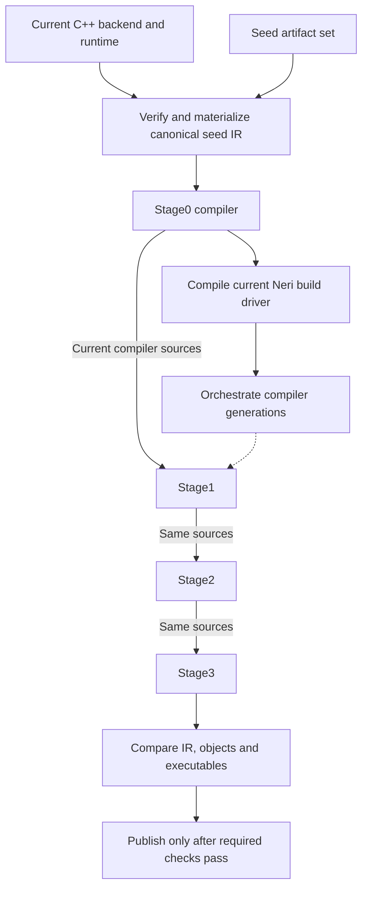

# Bootstrapping Neri

This page defines the seed trust boundary, compiler fixed point and seed-refresh
contract. For dependency installation, use [Building](BUILDING.md) or
[Windows](WINDOWS.md). Run the commands below from the repository root.

| Task | Entry point | Result |
| --- | --- | --- |
| Build native components without a seed | `scripts/build-native.sh` | Native backend, runtime and host helper |
| Bootstrap on macOS or Linux | `scripts/build.sh bootstrap` | Fixed-point compiler tuple selected by `build/current` |
| Validate before publishing a compiler tuple | `scripts/build.sh test` | Native and language contracts pass before publication |
| Regenerate the canonical seed | `scripts/build.sh refresh-seed` | Validated seed candidate and provenance replace the previous set |
| Build and test on Windows | `scripts/build.ps1 -Action test` | Windows fixed point and platform contracts |

The last four entries require the complete seed artifact set below. Native-only
compilation does not establish compiler or seed validation.

## Required seed artifacts

Bootstrapping requires these four files together. The launcher fails when a
file is absent or a digest does not match.

| File under `bootstrap/` | Contract |
| --- | --- |
| `compiler.nir.gz` | Canonical binary Neri IR, compressed with `gzip -n` |
| `SOURCE-MANIFEST.sha256` | Exact compiler, standard-library, manifest and template inputs |
| `VALIDATION-SOURCE-MANIFEST.sha256` | Broader source snapshot used by the validation run |
| `seed.json` | Artifact, IR and manifest hashes; producer identity, arguments and validation record |

[`scripts/build.sh`](../scripts/build.sh) and
[`scripts/build.ps1`](../scripts/build.ps1) require these files and verify their
hashes. They do not fetch an alternate compiler when a file is missing.

## Trust root

The seed format is canonical binary compiler IR in `bootstrap/compiler.nir.gz`, compressed
with gzip's filename and timestamp metadata disabled. The same seed is used on
macOS ARM64, Linux x86-64 and Windows x86-64. The host's C++ toolchain builds
Neri's native backend and runtime, which materialize this IR as the Stage0
compiler.

The `bootstrap/seed.json` schema records SHA-256 digests for the compressed artifact, its
uncompressed IR and `bootstrap/SOURCE-MANIFEST.sha256`. That source manifest
records repository-relative paths and exact content hashes for the seed's
inputs. Generated seed artifacts are excluded from their own source inventory.
The provenance identifies the producing compiler and compilation arguments.
`bootstrap/VALIDATION-SOURCE-MANIFEST.sha256` identifies the broader source tree
used for verification, including native code, tooling and tests. Its digest is
also recorded in the seed metadata. It records the bootstrap inputs present
during that verification run.

The launcher verifies the seed's artifact, IR and source-manifest digests before
executing it. Ordinary builds can compile changed sources using the fixed seed;
the current checkout need not match the seed's source inventory. Refreshing the
seed verifies source identity throughout generation and validation.

The seed IR, native backend, runtime and host toolchain form the trust
root. Content hashes detect mismatched artifacts; fixed-point checks establish
reproducibility for the checked sources and toolchain.

## Toolchain version transitions

The compiler checks the runtime's exact toolchain version in addition to its
IR transport, target, ABI version and required features. A canonical seed with
the previous version pin cannot compile against a runtime bearing a new version.

Before changing `VERSION`, generate a validated bridge seed whose runtime check
accepts exactly the previous and next versions. Keep the current version in
`VERSION` and the CLI during that refresh. Then update those values and restore
the compiler's strict check to the new version, and run `refresh-seed` again.
Both refreshes use the ordinary fixed-point and contract gates. The final
package gate materializes the final seed and validates the delivered toolchain;
run that gate instead of adding another standalone full test invocation.

Keep the ABI, feature, target and IR checks in place throughout this transition.
Seed artifacts and their provenance are published by the refresh command.

## Fixed point

The Unix flow is implemented by [the launcher](../scripts/build.sh) and
[`Build.bootstrap`](../tooling/build.hk):



`scripts/build.sh bootstrap` builds the native components, materializes Stage0
and uses it to compile the Neri build driver through the root `manifest.json`.
The driver performs three generations in an isolated `build/work.*` directory:

1. Stage0 compiles the current compiler unit into Stage1.
2. Stage1 compiles the same sources into Stage2.
3. Stage2 compiles the same sources into Stage3.
4. Stage1 and Stage2 must emit byte-identical serialized NIR envelopes and objects, and
   Stage2 and Stage3 executables must match byte for byte.

Every generation uses the current project manifest, compiler sources and
standard library. The NIR comparison uses the envelope's hexadecimal encoding;
objects and executables are compared directly. Each compiler
process receives the current native artifacts, LLVM linker, platform settings,
C locale, UTC and host `PATH`. Native configuration checks the supported
Clang/LLVM and Ninja versions and requires an explicit CMake build type.

The compiler executable basename is `neri` in each generation's directory.
The macOS linker embeds that basename in its ad-hoc signing identifier, making
it part of the reproducibility contract.

The verified Stage3 compiler, codegen, runtime and manifest are copied together
under `build/toolchains/<artifact-manifest-sha256>`. An atomic symlink replacement
selects that immutable tuple at `build/current`. Failures preserve the last
published tuple. Work directories retain comparisons and test output for
inspection.

`scripts/build.sh test` runs native probes and language contracts against the
current native artifacts and candidate compiler, then publishes the tuple after
those tests pass. `scripts/neri.sh` resolves `build/current` once and uses its
compiler, codegen and runtime with the standard-library sources from the same
checkout. Packaged launchers use their toolchain's bundled standard library.

Windows uses `scripts/build.ps1` to materialize the same seed, compile the
current compiler unit, compare NIR, COFF and PE output, and run its platform
contracts. See [Windows](WINDOWS.md) for dependencies and commands.

## Refreshing the seed

This command requires a working canonical seed; it cannot create the first seed
from native components alone.

```sh
scripts/build.sh refresh-seed
```

The Neri implementation in [`tooling/seed.hk`](../tooling/seed.hk) runs the native and language
contracts and fixed-point checks, emits canonical compiler IR, verifies its
source inventory and checks deterministic compression. It records the exact
source contents and producing compiler rather than treating a Git commit as
proof of the working tree's contents.

`seedSourceManifest` covers the compiler and standard-library source files,
their manifests and template assets. `Build.sourceManifest` captures the broader
validation inputs. Refresh compares both inventories before generation and
publication. `seedPublish` serializes publication with `build/seed-refresh.lock`,
backs up the previous files and attempts rollback if a replacement fails.

Review the refreshed artifact, source manifest and provenance together. The
repository's supported-platform CI jobs are configured to materialize the seed
on each host and validate current sources using that host's native toolchain.
Refresh prepares the candidate in an isolated work directory and promotes its
metadata last. Launchers reject mismatched artifact sets during publication;
the repository files are not a single atomic filesystem transaction.

Linux launchers use `/usr/lib/llvm-22` by default; `LLVM_PREFIX` selects another
installation. The persistent executable run cache supports macOS ARM64. Linux
and Windows compile and execute without persistent executable-cache reuse.

## Implementation and evidence

| Contract | Source |
| --- | --- |
| Native tool versions, target selection and runtime manifest | [CMakeLists.txt](../CMakeLists.txt), [native launcher](../scripts/build-native.sh) |
| Unix seed hash verification and Stage0 materialization | [scripts/build.sh](../scripts/build.sh) |
| Generations, comparisons and compiler publication | [tooling/build.hk](../tooling/build.hk) |
| Seed inventories, compression and publication | [tooling/seed.hk](../tooling/seed.hk) |
| Windows materialization, comparisons and source stability | [scripts/build.ps1](../scripts/build.ps1) |

These links identify implementation checks. Passing a fixed-point comparison
does not establish independent compiler correctness or cross-platform test
completion; those claims require the corresponding validation output.

## References

- [Zig's portable bootstrap seed](https://ziglang.org/news/goodbye-cpp/) describes
  a checked-in WebAssembly compiler seed materialized using the system toolchain.
  Neri applies that portable-artifact approach using its own canonical IR and
  native backend.
- [Wheeler, *Fully Countering Trusting Trust through Diverse Double-Compiling*](https://dwheeler.com/trusting-trust/dissertation/)
  distinguishes self-regeneration from independent source-to-binary assurance.
  Neri's fixed-point gate verifies self-regeneration; diverse double-compilation
  requires an independently trusted compiler.
