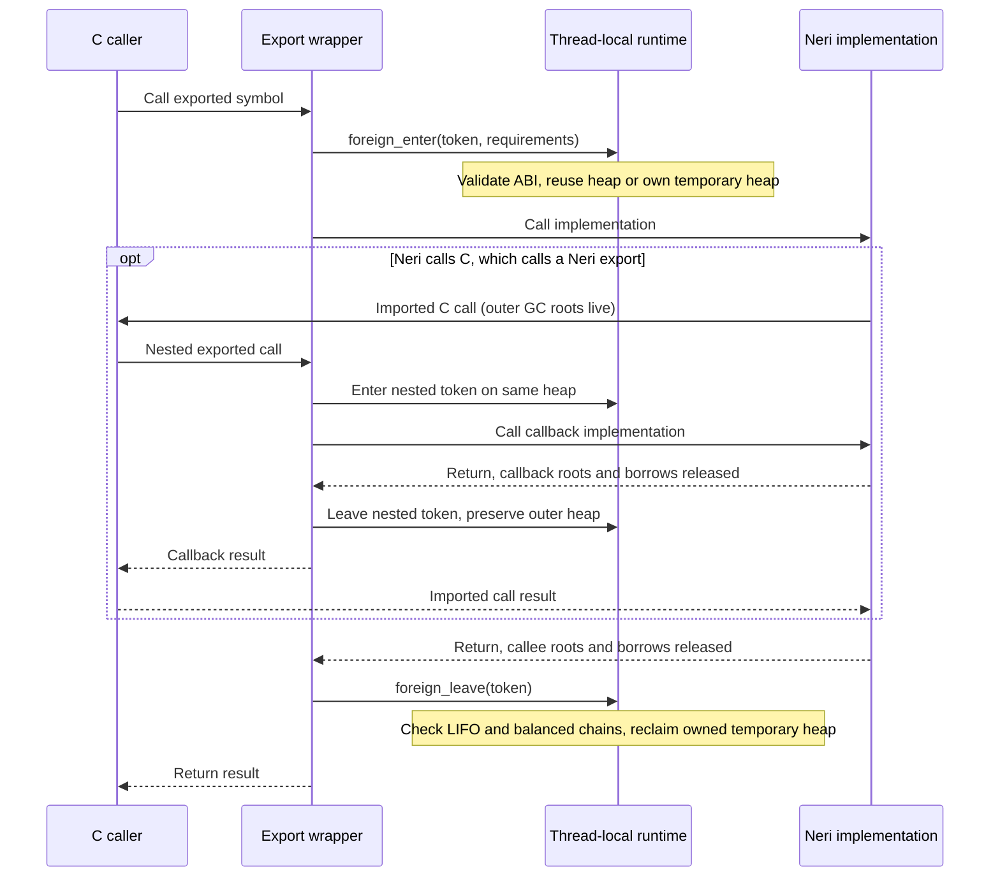

# Bidirectional C interoperability

Neri calls C through `@cabiImport`, exposes implementations through `@cabiExport`,
and represents callbacks as unmanaged `cabi fn` pointers. C calls and native
memory access require an `unsafe` declaration or block.

| Task | Contract |
| --- | --- |
| Call C and pass a Neri callback | [Import and export](#import-and-export) |
| Choose boundary types or nullable callbacks | [Types and calls](#types-and-calls) |
| Produce an object and C/C++ header | [Build a C-facing library](#build-a-c-facing-library) |
| Retain memory or register callbacks | [Lifetime and threads](#lifetime-and-threads) |
| Understand reentry, GC and panic | [Foreign entry](#foreign-entry), [failure boundary](#failure-boundary) |

## Import and export

This `callbacks.hk` implements `C → Neri → C → Neri`:

```neri
@cabiImport("host_apply")
unsafe def apply(operation: cabi fn(Int32): Int32, value: Int32): Int32
end

@cabiExport("sample_increment")
unsafe def increment(value: Int32): Int32
  return value + (1 as Int32)
end

@cabiExport("sample_roundtrip")
unsafe def roundtrip(): Int32
  let callback: cabi fn(Int32): Int32 = increment
  return apply(callback, 41 as Int32)
end
```

Save this C host as `host.c`; it supplies the imported symbol and includes the
generated header:

```c
#include "callbacks.h"

int32_t host_apply(int32_t (*operation)(int32_t), int32_t value) {
    return operation(value);
}

int main(void) {
    return sample_roundtrip() == 42 ? 0 : 1;
}
```

An export must be a module-level, nongeneric `unsafe def` with an implementation,
explicit parameter types, and no defaults or parameter modes. Its annotation
selects the exact linker symbol: an ASCII C identifier, unique across C
declarations in the compilation. `main` and prefixes `neri_`, `hk1_`, and `__`
are reserved. Header emission adds [C/C++ naming restrictions](#generated-headers).

## Types and calls

| Neri boundary type | C representation |
| --- | --- |
| `Int`, `Int32` | `int64_t`, `int32_t` |
| `UInt32`, `UInt64` | `uint32_t`, `uint64_t` |
| `Byte`, `Bool` | `uint8_t` |
| `Float32`, `Float` | `float`, `double` |
| `Void` result | `void` |
| `T*`, `T*?` | pointer to the unmanaged representation of `T` |
| `cabi fn(P): R` | C function pointer with parameter `P` and result `R` |
| `(cabi fn(P): R)?` | nullable C function pointer |

- `Bool` accepts zero as false and any nonzero byte as true; results are zero or
  one. Declare it as `uint8_t` in C; `_Bool` has a different type.
- Native records and fixed arrays cross through pointers. Managed values such
  as `String`, classes, arrays and `fn` closures are not public C boundary types.
- Signatures match exactly and are checked recursively, including function
  pointers used as parameters or results.
- A named C import or export converts to `cabi fn` in a typed context: an
  argument, return, field assignment, or annotated local. Runtime intrinsics and
  runtime ABI imports cannot supply public C function pointers. Managed closures
  cannot convert, including closures without captures.
- Indirect calls require `unsafe` and positional arguments. Native record fields,
  fixed arrays and pointer loads/stores preserve the signature. Managed arrays
  cannot store C function pointers; use native storage such as `stackalloc`.

Nullable callbacks must be narrowed before calling:

```neri
@cabiExport("sample_optional")
unsafe def optional(operation: (cabi fn(Int32): Int32)?, value: Int32): Int32
  if operation != null
    return operation(value)
  end
  return -1 as Int32
end
```

Function pointers have no captured environment. APIs requiring state pass an
explicit unmanaged context pointer with the [lifetime rules](#lifetime-and-threads)
below.

## Build a C-facing library

Declare a library unit with exports and no `main` in `manifest.json`:

```json
{
  "version": 2,
  "defaultUnit": "callbacks",
  "units": {
    "callbacks": { "kind": "library", "sources": ["callbacks.hk"] }
  }
}
```

```sh
neri build --project manifest.json --unit callbacks --emit=obj --output callbacks.o
neri build --project manifest.json --unit callbacks --emit=c-header --output callbacks.h
```

Compile the host as C, then link its object, `callbacks.o`, and the matching Neri
runtime archive using the target's C++ linker. Also link libraries declared by
imports. Use one runtime instance for the host's Neri objects. Library
implementation symbols have local linkage; exports retain their public names.

| Target | Installed runtime archive | Platform link flags |
| --- | --- | --- |
| macOS ARM64 | `lib/libneri-runtime.a` | `-pthread` |
| Linux x86-64 | `lib/libneri-runtime.a` | `-pthread -lcrypto` |
| Windows x86-64 | `lib/neri-runtime.lib` | `-lws2_32 -lbcrypt -lshell32` |

For example, on macOS ARM64 with LLVM 22.1.8 on `PATH`, replace the archive path
with the installed toolchain's runtime:

```sh
clang -std=c17 -Wall -Wextra -Werror -c host.c -o host.o
clang++ host.o callbacks.o /absolute/toolchain/lib/libneri-runtime.a -pthread -o host
./host
```

The host exits with status `0` when the callback returns `42`.

Hosts using runtime lifecycle APIs include the installed
`include/neri/runtime_abi.h` and generated ABI constants. Define
`NERI_RUNTIME_STATIC` when compiling against the static runtime, including on
Windows. See [runtime ABI](ABI.md) for its versioned structures.

### Generated headers

Headers declare exported signatures and reachable native record layouts. Use
emitted record/field identifiers and function-pointer parentheses directly.
Headers compile as C17 and C++23.

Header emission rejects C/C++ keywords, standard integer-header names, names
starting with `_`, and names containing `__`. It also rejects reachable record
layouts whose pointers to fixed arrays require cyclic C type completeness.
These are header declaration constraints; object emission follows Neri's native
layout and export-symbol rules.

## Foreign entry

Every exported wrapper negotiates runtime requirements and executes synchronously
on the calling native thread. The compiler emits the entry/leave guards; Neri
source cannot import `neri_rt_v1_foreign_enter` or `neri_rt_v1_foreign_leave`.



Each heap has a checked entry stack. Tokens leave their owning heap in reverse
order, restoring the root and borrow chains present on entry. Reentry preserves
outer GC roots. Foreign calls conservatively permit reads, writes, managed and
native allocation, collection, and panic.

## Lifetime and threads

| Calling thread's runtime state | Heap ownership and return behavior |
| --- | --- |
| Uninitialized | Outermost export owns a temporary heap; return reclaims managed objects and `native::alloc` allocations. |
| Already initialized | Export reuses the heap and preserves host ownership; leaving an export does not shut it down. |

- To retain `native::alloc` memory across calls, the host initializes that thread
  with `neri_rt_v1_initialize`, checks its ABI status, and calls
  `neri_rt_v1_shutdown` after final use. Shutdown requires completed foreign
  entries and released roots and borrows.
- Without host-owned initialization, returned data pointers must refer to
  caller-owned or independently allocated storage. Raw pointers neither retain
  managed objects nor transfer ownership. Even on an initialized heap, a Neri
  object passed as an opaque context needs a GC root to survive collection.
- Foreign threads enter independent heaps. Callers synchronize shared external
  memory and obey each runtime service's thread/process ownership contract.
  Independent heaps do not grant concurrent access to process-global services.
  Signal-handler entry is outside the runtime contract.
- Function addresses remain valid while their code module is loaded. Before
  freeing callback context or unloading code, unregister callbacks and wait for
  all queued and active calls to finish.

## Failure boundary

Neri panic terminates the process with status **70**, including through C entry
points. Recoverable errors need an explicit scalar status or output buffer in
the signature. Foreign exceptions and `longjmp` must not cross active Neri
frames; the boundary has no stack-unwinding protocol.

## Executable evidence

The following executable contracts are available in the source checkout.

| Contract | Executable evidence |
| --- | --- |
| Scalar ABI, nullable/returned callbacks, native records, reentrant GC, independent library symbols, foreign threads and panic | [Neri fixture](../tests/native/cabi-exports/fixture.hk), [independent C host](../tests/native/cabi_exports.c), [Debug/Release driver](../tests/native/cabi-exports/driver.hk) |
| Heap ownership, root/borrow balance, entry misuse and ABI negotiation | [Runtime probe](../tests/native/foreign_entry.c); subprocess and pthread misuse cases are POSIX-only |
| Unsafe use, incompatible signatures, closure conversion and unmanaged arrays | [Rejected source fixture](../tests/contracts/cabi-callback-errors.hk) |
| Malformed IR signatures, calls and effects rejected before LLVM | [ABI import contracts](../tests/abi-import-contract.hk) |

## Design references

These references explain related FFI designs; Neri's contracts are stated above.

- Finne et al., [Calling Hell from Heaven and Heaven from Hell](https://www.microsoft.com/en-us/research/wp-content/uploads/2016/07/comserve.pdf): externally callable code, closure environments and retention.
- Marlow et al., [Extending the Haskell Foreign Function Interface with Concurrency](https://www.microsoft.com/en-us/research/wp-content/uploads/2004/09/conc-ffi.pdf): native-thread identity and callbacks.
- [Haskell FFI specification](https://www.haskell.org/onlinereport/haskell2010/haskellch8.html): reentrant foreign calls and export boundaries.
- [Rust function pointers](https://doc.rust-lang.org/reference/types/function-pointer.html) and [Rustonomicon FFI](https://doc.rust-lang.org/nomicon/ffi.html): ABI-qualified callable types, callback lifetime and unwinding.
- LLVM [calling conventions](https://llvm.org/docs/LangRef.html#calling-conventions) and [parameter attributes](https://llvm.org/docs/LangRef.html#parameter-attributes): native declarations, definitions and call sites must agree on the target C ABI.
