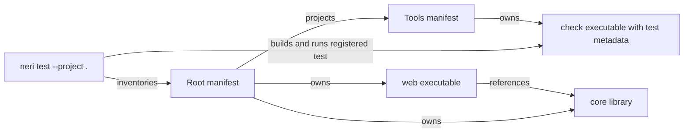

# Compilation projects

`manifest.json` defines source ownership, library dependencies and workspace
membership. Use [workspace members](#workspace-members) for `projects` versus
`references`, [registered tests](#registered-project-tests) for test discovery,
and [command line](#command-line) for unit selection.

`neri project-units --project <directory|manifest.json>` lists each executable
unit with each owned source, separated by a tab. Automation can select source
roles from this validated membership instead of deriving a unit name from a
source filename.

`neri run --project .` discovers the directory's `.hk` sources as one executable
unit named `main` when the directory has no project manifest. The same source
exclusions and nested-project boundaries apply to inferred and explicit units.
Simple executable projects need only their source files.

A version-2 `manifest.json` contains named compilation units. A unit owns its
sources and can depend on library units without making namespaces depend on the
directory layout:

```json
{
  "version": 2,
  "defaultUnit": "web",
  "projects": ["tools/manifest.json"],
  "units": {
    "core": {
      "kind": "library",
      "sources": ["src/core"],
      "exclude": [],
      "references": []
    },
    "web": {
      "kind": "executable",
      "sources": ["app"],
      "exclude": [],
      "references": ["core"]
    }
  }
}
```

The manifest uses strict JSON. Unknown keys, duplicate keys, trailing content,
and values with incorrect types are configuration errors, including in units
other than the selected unit. `exclude`, `references` and `generated` are optional.
The accepted filenames are `manifest.json` and `neri.json`; a project directory must
contain at most one of the two filenames.

`defaultUnit` selects the unit used when the command does not pass `--unit`.
Every unit declares `kind` as `library` or `executable`. A local reference is
the name of another unit in the same manifest. An external reference names both
the other manifest and one of its units:

```json
{ "project": "../shared/manifest.json", "unit": "core" }
```

References may target only library units. The complete reference closure is
deterministic: missing units, cycles and overlapping ownership of a canonical
source file are configuration errors. A diamond dependency is loaded once.

## Workspace members

| Manifest field | Makes available | Effect on tests |
| --- | --- | --- |
| Unit `references` | Library declarations in that unit's compilation closure | Does not register the referenced project's executable tests |
| Top-level `projects` | Member units for project-wide inventory and operations | Registers the member's explicitly declared test units |

The optional top-level `projects` array declares other manifests that belong to
the same workspace. Each entry is a relative path ending in `manifest.json` or
`neri.json`, using the same normalized path rules as an external unit
reference. Entries are literal paths and are not interpolated. Duplicate entries
are configuration errors.

Project-wide agent operations inventory every unit in each declared member and
follow nested `projects` arrays recursively. Membership makes those units
discoverable; it does not combine their sources into one compilation unit.
Namespaces and types remain visible only through explicit unit `references`, so
independent executables in member projects do not create conflicting `main`
functions.

Membership and references serve separate purposes. An external unit reference
adds a library to one compilation closure without registering the external
project's tests. A path in `projects` registers the member's declared test units
for project-wide test operations even when no root unit references them.



In this graph, `web` can use `core` declarations. The `check` test is discovered
through `projects`; accessing `core` from `check` additionally requires a library
reference. Owning an executable does not register it as a test without `test`
metadata.

## Sources and exclusions

Each `sources` entry is relative to the manifest and is either an explicit
`.hk` file or a directory. Directories, including `.`, are discovered
recursively. `exclude` entries are literal relative files or directory
subtrees. Version 2 does not support globs.

Discovery skips symlinks, generated-output directories, and descendant
directories containing their own `manifest.json` or `neri.json`. The generated directories are
`.git`, `.neri`, `.cache`, `.idea`, `.bootstrap`, `build`, `out`, `dist`,
`target`, and `bin`. Manifest aliases resolve to canonical paths, but discovery
does not follow symlinks. `.hk` basenames must not contain whitespace, including
Unicode whitespace; directory names may contain spaces.

Source paths define compilation membership, not namespaces. Files in unrelated
folders may declare the same namespace, and folder names never create or infer
namespaces. `namespace` and `use` resolve names inside the selected unit and its
explicit reference closure; they do not add dependencies.

`generated` lists relative JSON generation manifests. The selected reference
closure validates their input/output digests and loads their emitted `.hk`
declarations from retained content snapshots. Project formatting discovers
hand-written sources and skips these owned outputs. See
[generated source contracts](GENERATED-SOURCES.md) for publication, regeneration
and original-source navigation.

Libraries must not declare `main`. Executable units must declare exactly one
`main`; additional entry points are rejected by the binder.

A library unit can expose C-callable functions with `@cabiExport`.
`build --emit=obj` emits its linkable native object, and `build --emit=c-header`
emits the corresponding public declarations and reachable native record layouts.
See [C interoperability](C-INTEROP.md) for host linking and runtime ownership.

## Registered project tests

An executable unit may opt into project-wide test runs with a `test` object:

```json
"test": {
  "arguments": ["{project}", "{compiler}", "{work}", "literal"],
  "timeoutMs": 120000
}
```

`arguments` is required and may be empty. `timeoutMs` is optional and defaults
to 120000 milliseconds. It accepts integers from 1 through 600000. A test may
declare at most 64 arguments of at most 4096 bytes each and 65536 bytes in
total. Test metadata on a library unit is a configuration error.

The test runner passes arguments directly to the executable without a shell.
An argument equal to `{project}`, `{compiler}`, or `{work}` resolves to the
manifest directory, the current compiler executable, or a fresh temporary
directory. Placeholders embedded in a larger argument remain literal.

`neri.test` discovers the complete declared workspace and runs every registered
test unit in the root manifest and its `projects` members. Referenced external
projects do not contribute test units unless they are also declared members.
Each unit is built from the captured project snapshot and then run with bounded
output and its declared timeout. The result reports the member unit count, the
registered test count, build snapshots, executable SHA-256 digests, exit status,
and captured output. A changed graph produces `conflict`. A project without
registered tests produces the explicit `noTests` state and does not report a
successful test run.

## Command line

```sh
neri check --project manifest.json --unit core
neri build --project manifest.json --unit web --output build/web
neri run --project manifest.json --unit web
```

`--unit` requires `--project` and overrides `defaultUnit`. Explicit source
arguments cannot be combined with `--project`. Compiler flags such as
`--release`, `--target`, and `--output` remain independent of source membership.

An inferred project accepts `--unit main`. Selecting another unit reports that
`manifest.json` is needed to declare additional units. Entry-point diagnostics
offer a manifest suggestion when inferred sources may describe a library or
several programs. The original semantic error remains the primary diagnostic.

## Standard-library sources

The compiler and language server resolve standard-library module names through
`<NERI_STDLIB>/manifest.json`. Each module is a library unit and may own multiple
`.hk` files. The `core` unit must include `core.hk`. Sources must remain inside
the standard-library directory. Without that manifest, module lookup uses
`<NERI_STDLIB>/<identifier>.hk`.

Available sources are loaded once, including transitive imports and cycles.
Names supplied by the program or built-in libraries use ordinary semantic
resolution; unresolved imports produce compiler diagnostics. The toolchain
launcher selects its library directory through `NERI_STDLIB`.

## Language server

For each document, the server selects the nearest ancestor `manifest.json` or `neri.json`, stopping
at the workspace root for documents inside it. Nested manifests are independent
project boundaries. Within a v2 manifest, a source is analyzed in the unit that
owns it. This is important for shared code: opening a library source selects the
library itself, not an arbitrary executable that references it. A file outside
all declared units under an explicit manifest has unavailable semantic context;
the language server reports `NR_PROJECT_CONTEXT` until a unit owns it. A
workspace without a manifest is an implicit project and analyzes its `.hk`
sources together, including its first unsaved document.

The selected unit is analyzed with its transitive library references and the
standard library. Open documents supply their current in-memory contents,
including dependencies; other members are read from disk. Editing an open
dependency reanalyzes its open consumers, and closing it restores the disk
contents for subsequent analysis.

A `workspace/didChangeWatchedFiles` notification reloads manifests and automatic
directory membership. Clients must report create, change and delete events for
closed `.hk` files, source directories, and relevant `manifest.json` or `neri.json` files. This
makes newly created or removed sources, exclusions, references, and nested
project boundaries take effect without restarting the server.

Compilation units describe source and type dependencies. The compiler flattens
only the selected unit's reference closure into one analysis. Declared workspace
members provide a bounded project-wide inventory without inferring membership
from the directory tree. Neri does not provide dependency artifact distribution,
package version resolution or package fetching. Agent operations reuse unchanged
unit analyses as described in
[revisions and snapshots](AGENT-FEEDBACK.md#revisions-and-snapshots).

## Contract project discovery

The build tooling discovers and sorts `main.hk` files under
`tests/value-contracts` and `manifest.json` files under `tests/runtime-contracts` on each run. An empty
inventory fails validation. Value contracts infer one executable from each source directory and run it in
Debug and Release. Runtime contracts declare `fixture` and `driver` executable
units. The driver receives a fresh data directory, the fixture executable path,
and the native target; it owns the scenario's setup and assertions in Neri.
Adding a project under either directory includes it in the corresponding suite.
